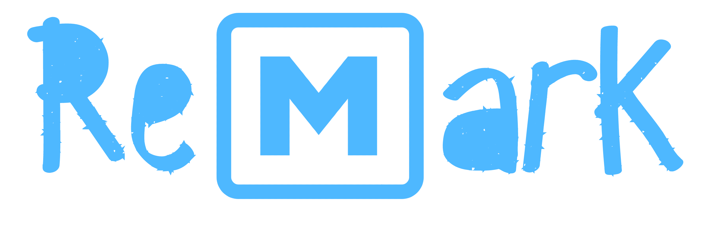
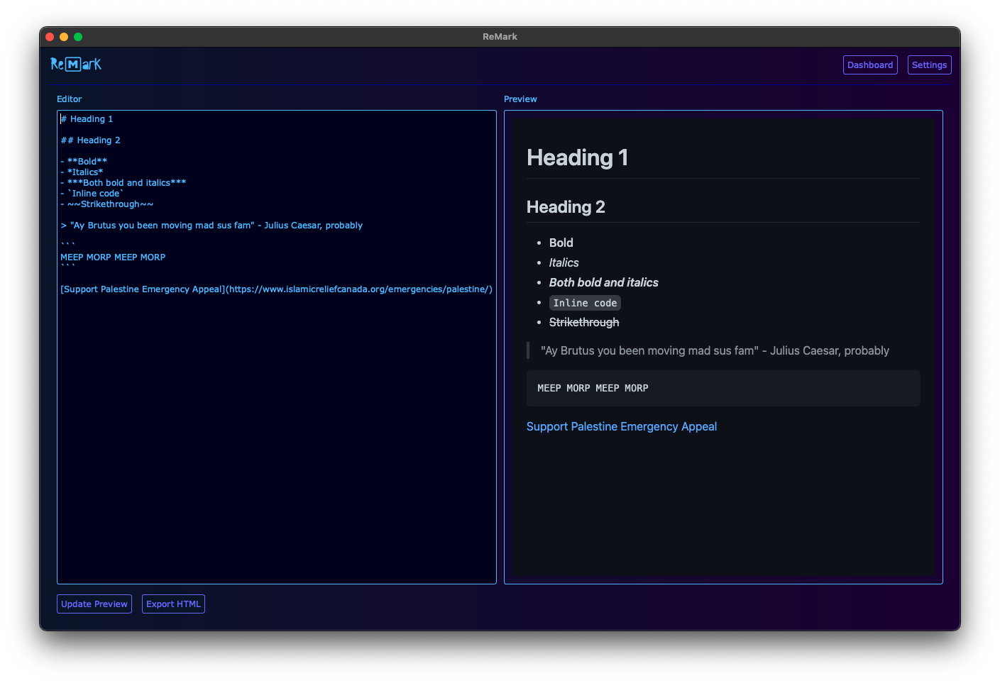
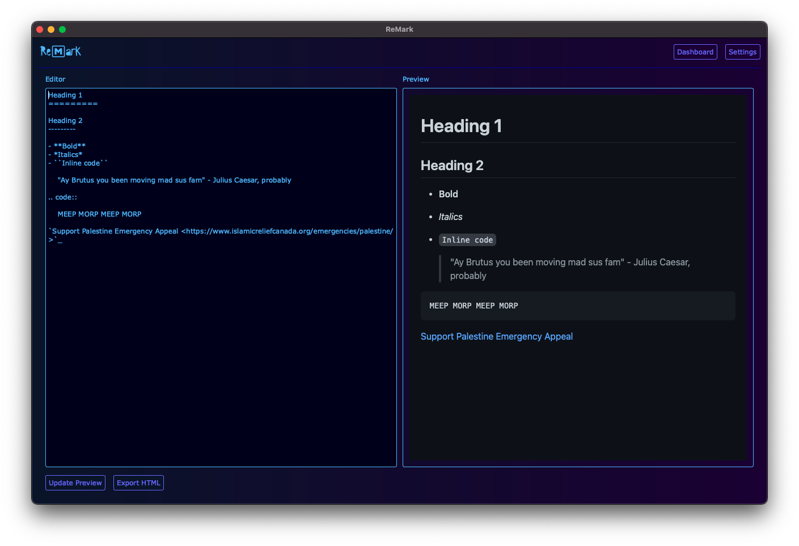
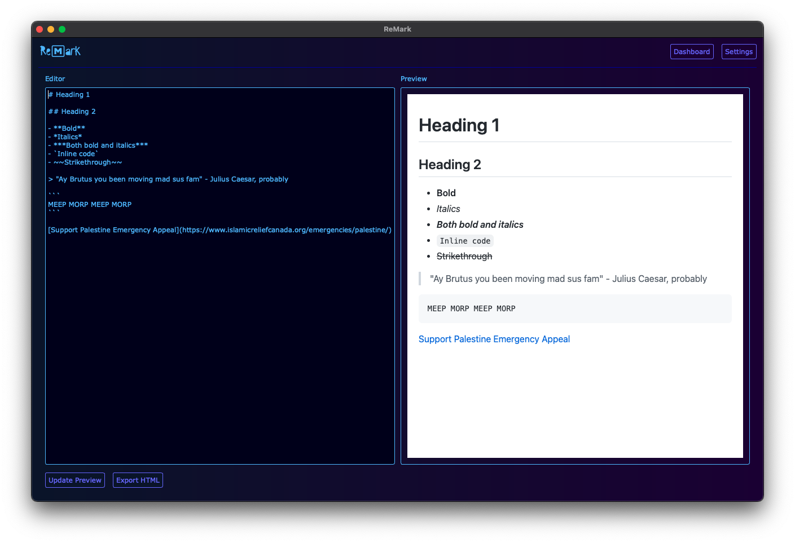
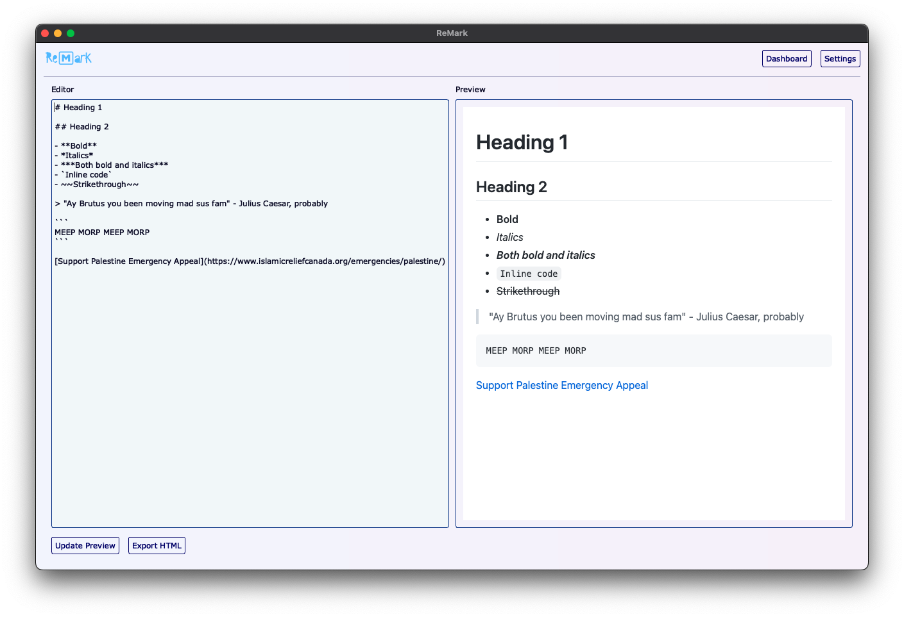
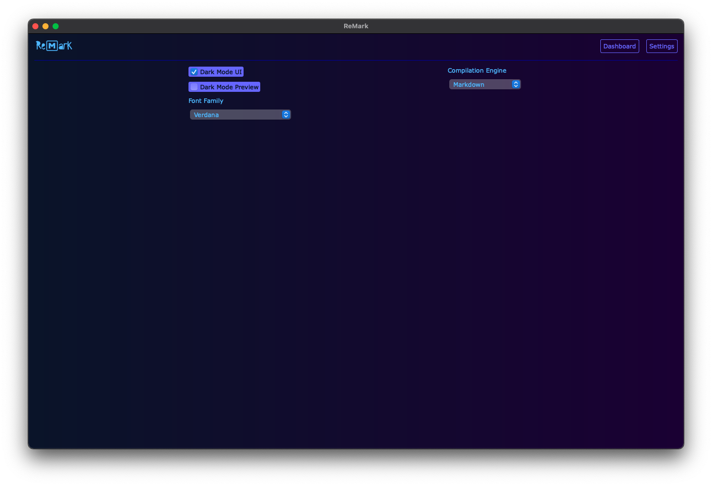

<p align="center">
    
</p>

<p align="center">
    <strong><i>ReMark</i></strong> is a minimalistic Markdown and reStructuredText editor, built using PyQt6.
</p>

# Installation

## Clone the repository

```bash
git clone https://github.com/alvii147/ReMark.git
```

## Install dependencies

```bash
pip3 install -r requirements.txt
```

## Run ReMark

```bash
python3 ReMark.py
```

# Overview

## Markdown Editor



## reStructuredText Editor



## Light Mode Preview



## Light Mode UI



## Settings


